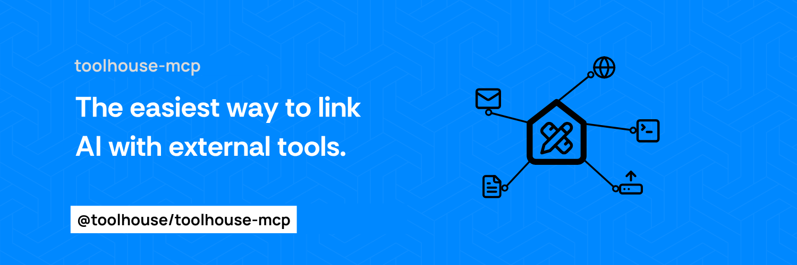

# Toolhouse MCP Server



This MCP server allows you to connect MCP clients with Toolhouse's tools. Built on top of [Toolhouse](https://toolhouse.ai/).

[The Model Context Protocol (MCP)](https://modelcontextprotocol.io/introduction) is an open protocol that enables seamless integration between LLM applications and external data sources and tools. Whether you’re building an AI-powered IDE, enhancing a chat interface, or creating custom AI workflows, MCP provides a standardized way to connect LLMs with the context they need.

## Features

- Allows compatible MCP Clients (i.e Claude Desktop App) to access a vast library of tools to enhance their capabilities

## Configuration

### Setup Environment Variables

1. **Toolhouse API Key**:
   You need a Toolhouse API Key to access the Toolhouse platform.

   - Sign up at [Toolhouse](https://toolhouse.ai/) and create an account, it's FREE to get started.
   - Obtain your API key from the Toolhouse dashboard.

2. **Toolhouse Bundle**:
   You need to create a bundle, essentially a group of tools you can assemble from the ones available on the Toolhouse platform.

   - Navigate to [Toolhouse Bundles]() and create a bundle with any name i.e. `mcp-toolhouse`
   - Add the tools that you want to use on your client i.e. Scrape the web, Memory, Send Email
   - Ensure your bundle looks good (it auto saves)

3. (Optional) Set these environment variables if you prefer not having them in the configuration:
   ```bash
   export TOOLHOUSE_API_KEY="your_toolhouse_api_key"
   export TOOLHOUSE_BUNDLE="your_bundle_name"
   ```

### Starting the server

> [!TIP]
> If you are stuck configuring your client, i.e. Cursor, Windsurf, Cline etc... open an Issue here on Github and I will help you personally.

Add this server to your client's configuration.
For example on Claude's desktop app navigate to the folder and manually change the settings file called `claude_desktop_config.json`

On MacOS:

```bash
~/Library/Application\ Support/Claude/claude_desktop_config.json
```

On Windows:

```bash
%APPDATA%/Claude/claude_desktop_config.json
```

Modify the configuration file to look like this:

## With UVX

```json
{
  "mcpServers": {
    "toolhouse-mcp": {
      "command": "uvx",
      "args": ["mcp_server_toolhouse"],
      "env": {
        "TOOLHOUSE_API_KEY": "your_toolhouse_api_key",
        "TOOLHOUSE_BUNDLE": "a_bundle_name"
      }
    }
  }
}
```

## With UV

```json
{
  "mcpServers": {
    "toolhouse-mcp": {
      "command": "uv",
      "args": [
        "--directory",
        "/basepath/to/repo/",
        "run",
        "mcp_server_toolhouse"
      ],
      "env": {
        "TOOLHOUSE_API_KEY": "your_toolhouse_api_key",
        "TOOLHOUSE_BUNDLE": "a_bundle_name"
      }
    }
  }
}
```

### Run this project locally

This project is not yet configured for ephemeral environments like `uvx`. Run the project locally by cloning the repository:

```bash
git clone https://github.com/toolhouseai/toolhouse-mcp
```

Add this tool as an MCP server.

On MacOS:

```bash
~/Library/Application\ Support/Claude/claude_desktop_config.json
```

On Windows:

```bash
%APPDATA%/Claude/claude_desktop_config.json
```

Modify the configuration file to include:

```json
"toolhouse": {
    "command": "uv",
    "args": [
        "--directory",
        "/basepath/to/this/repo/",
        "run",
        "mcp_server_toolhouse"
    ],
    "env": {
        "TOOLHOUSE_API_KEY": "your_toolhouse_api_key",
        "TOOLHOUSE_BUNDLE": "a_bundle_name"
    }
}
```

## TODO

Future improvements include:

- Adding test coverage for all modules
- Extending API support for enhanced tool configurations

## Debugging

Since MCP servers run over stdio, debugging can be challenging. For the best debugging experience, use the [MCP Inspector](https://github.com/modelcontextprotocol/inspector).

Launch the Inspector via [`npm`](https://docs.npmjs.com/downloading-and-installing-node-js-and-npm):

```bash
npx @modelcontextprotocol/inspector uv --directory /path/to/toolhouse_mcp run mcp_server_toolhouse
```

The Inspector will display a URL to access debugging tools in your browser.
